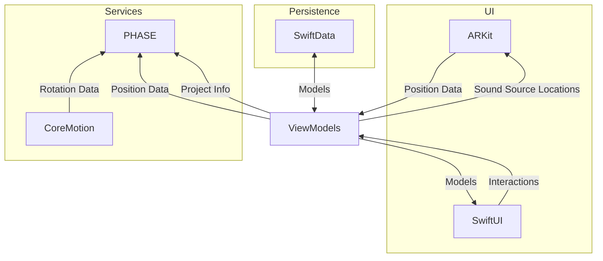

# Phasor

**Spatial Audio With Translational and Rotational Movement**

## Development

Phasor uses [Tuist](https://tuist.io) for development. 

```zsh
# assuming tuist and gh cli are installed
gh repo clone gyoge0/Phasor
cd Phasor
tuist generate
```

## Ignored Music

Phasor uses some licensed music which is not checked into git. See the table below for music that needs to be added.

|Name            |Path                                            |
|----------------|------------------------------------------------|
|Espresso Backing|`Phasor/Resources/Espresso/espresso_backing.m4a`|
|Espresso Bass   |`Phasor/Resources/Espresso/espresso_bass.m4a`   |
|Espresso Drums  |`Phasor/Resources/Espresso/espresso_drums.m4a`  |
|Espresso Guitar |`Phasor/Resources/Espresso/espresso_guitar.m4a` |
|Espresso Vocals |`Phasor/Resources/Espresso/espresso_vocals.m4a` |

## Architecture

See the mermaid diagram:

